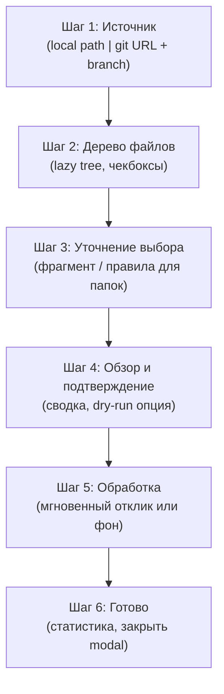
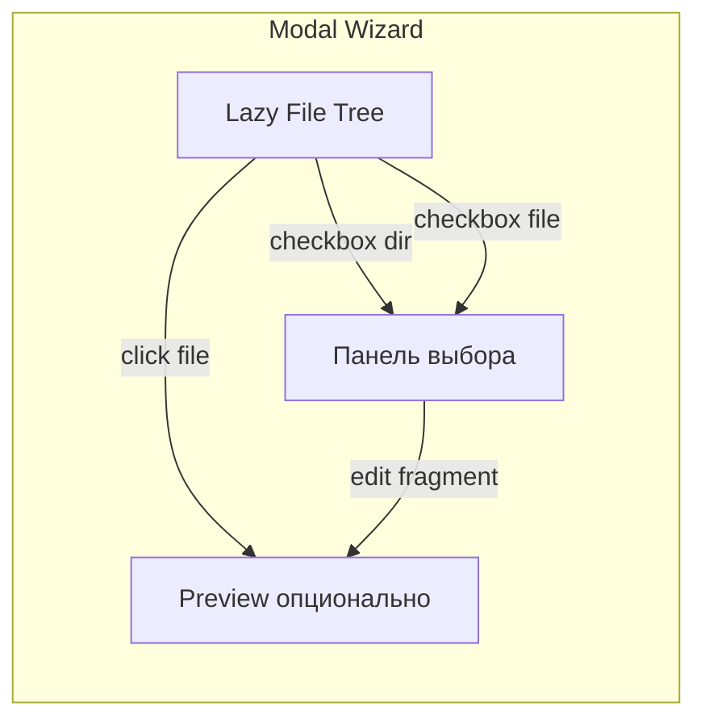
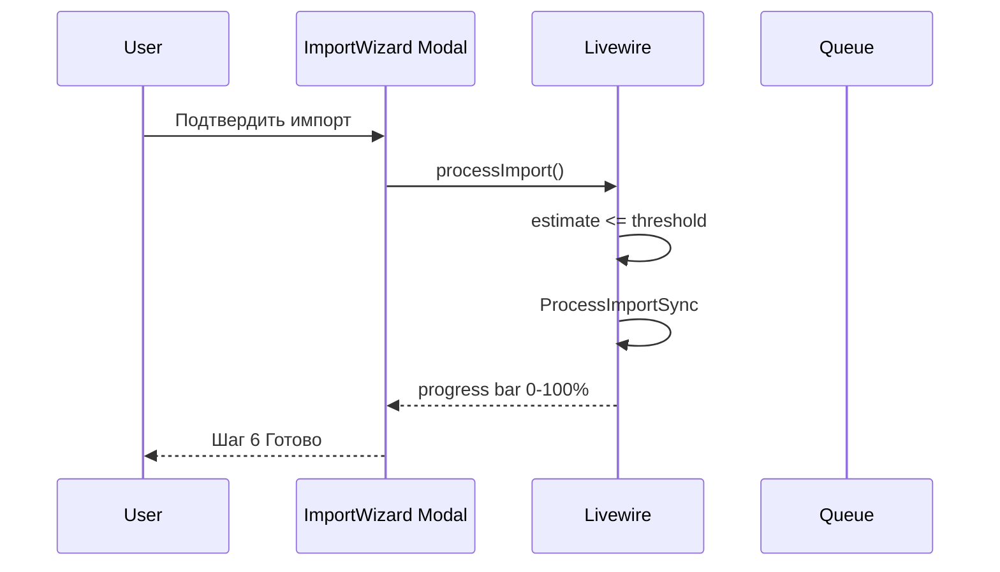
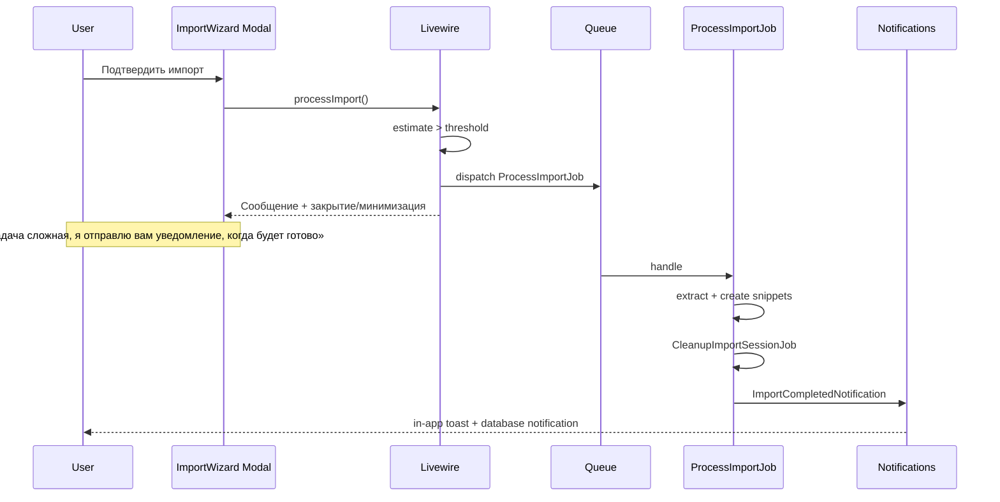
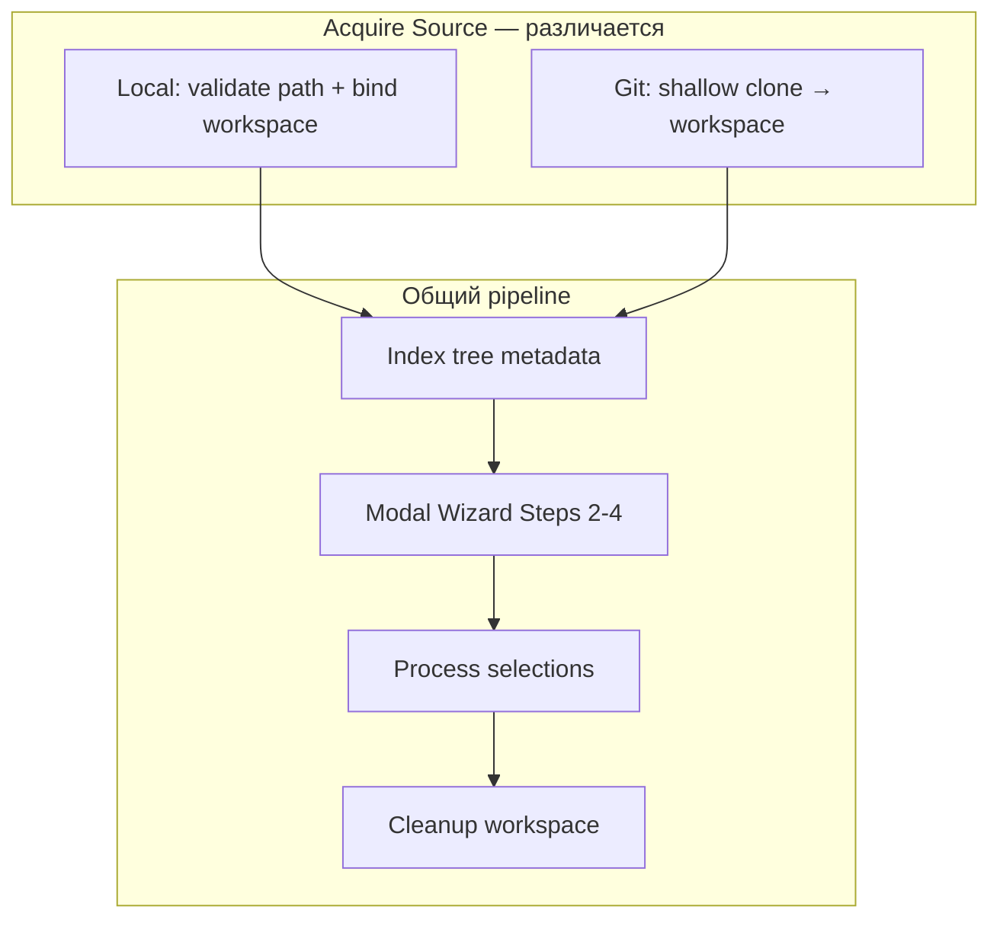
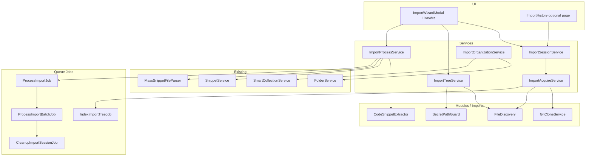
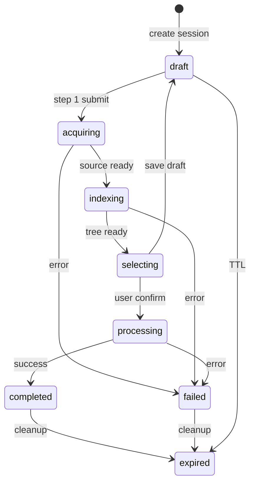
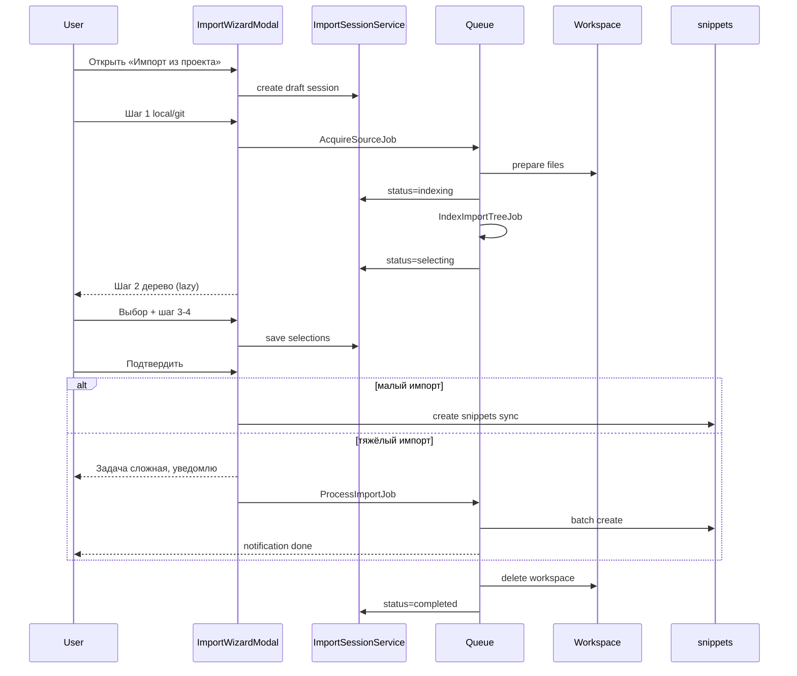

# Мастер импорта кода в библиотеку (Import Wizard)

> **Статус:** спецификация и план реализации. Код этапа **не начат** — документ является единственным источником правды до старта разработки.

## Содержание

1. [Видение](#видение)
2. [Зафиксированные решения](#зафиксированные-решения)
3. [Что не входит в этап](#что-не-входит-в-этап)
4. [UX: модальный wizard в реальном времени](#ux-модальный-wizard-в-реальном-времени)
5. [Производительность и фоновая обработка](#производительность-и-фоновая-обработка)
6. [Единый сценарий: local и git](#единый-сценарий-local-и-git)
7. [Архитектура](#архитектура)
8. [Модель данных](#модель-данных)
9. [Модули и сервисы](#модули-и-сервисы)
10. [Режимы извлечения сниппетов](#режимы-извлечения-сниппетов)
11. [Безопасность и Docker](#безопасность-и-docker)
12. [Интеграция с существующими фичами](#интеграция-с-существующими-фичами)
13. [Волны реализации](#волны-реализации)
14. [Тестирование](#тестирование)
15. [Ветки и коммиты](#ветки-и-коммиты)
16. [Риски](#риски)
17. [Критерии готовности MVP](#критерии-готовности-mvp)

---

## Видение

**CodeSnip** на этом этапе получает не «менеджер репозиториев», а **мастер импорта**: пользователь подключает внешний код (локальная папка или git), **видит дерево файлов**, **сам выбирает** что попадёт в библиотеку, настраивает правила извлечения — и в результате получает **постоянные сниппеты**. Исходные файлы проекта **не хранятся** после завершения операций.

### Отличие от Folder

| Сущность | Назначение |
|----------|------------|
| **Folder** | Ручная группировка сниппетов внутри приложения |
| **Import session** | Временная сессия импорта: workspace + дерево + выбор пользователя → сниппеты |

### Цели

- Единый UX для **local** и **git** (различается только шаг получения дерева).
- **Интерактивный выбор**: папки, файлы, фрагменты кода (диапазон строк).
- Для выбранных **директорий** — шаг правил: по файлам / по символам (методы, функции) / структурированные custom rules.
- **Максимальная отзывчивость UI** в модальном wizard; тяжёлая работа — в очереди с уведомлением.
- **Эфемерное хранение** workspace: удаление после успешного импорта и cleanup.
- **Происхождение** сохраняется в метаданных сниппета (путь, строки, fingerprint), даже когда workspace уже удалён.

---

## Зафиксированные решения

| # | Вопрос | Решение |
|---|--------|---------|
| 1 | Хранить клон репозитория постоянно? | **Нет.** Только на время сессии (wizard + jobs), затем cleanup |
| 2 | История импортов в UI? | **Да** — список прошлых сессий **без файлов** (имя, дата, источник, статистика) |
| 3 | Повторный импорт того же git URL? | **Новая сессия** (не «продолжить» старую) |
| 4 | Выбор фрагмента | **Оба способа:** выделение в превью (CodeMirror) + ручной ввод строк `10–45` |
| 5 | Custom rules v1 | **Structured:** glob include/exclude, пресеты по языку, исключения (`*Test.php`), без пользовательских скриптов |
| 6 | UI | **Модальное окно**, пошаговый wizard, обновления в реальном времени (Livewire) |
| 7 | Долгая обработка | Сообщение: *«Задача сложная, я отправлю вам уведомление, когда будет готово»* + in-app toast + опционально database notification |
| 8 | Re-sync живого репо | **Не в MVP.** Повтор = новая сессия; дедуп по `source_fingerprint` |

---

## Что не входит в этап

- Командные / shared workspace импорты.
- Двусторонняя синхронизация изменений обратно в git.
- Произвольные пользовательские скрипты правил.
- IDE-плагин.
- Постоянное зеркало репозитория с auto-pull.
- Приватный git по SSH в MVP (опционально позже; HTTPS + token).

---

## UX: модальный wizard в реальном времени

### Точка входа

- Кнопка в sidebar / на dashboard / на странице сниппетов: **«Импорт из проекта»**.
- Открывает **одно модальное окно** (`flux:modal`) на весь flow — без перехода на отдельные страницы (кроме опциональной «История импортов»).

### Шаги wizard



| Шаг | Содержание | Ожидание по времени |
|-----|------------|---------------------|
| 1 | Имя сессии, тип источника, path или git URL | < 1 с до перехода (валидация формы) |
| 2 | Дерево: раскрытие папок **lazy**, чекбоксы на dir/file, панель «Выбрано» | Первый уровень < 300 ms; дочерние узлы по запросу |
| 3 | Файл: превью + выделение фрагмента или строки; Папка: file / symbol / custom rules | Превью файла < 500 ms для файлов до лимита размера |
| 4 | Сводка: N файлов, ~M сниппетов, опции папки/тегов | Мгновенно (оценка из кэша индекса) |
| 5 | Запуск обработки | См. [производительность](#производительность-и-фоновая-обработка) |
| 6 | Toast + краткая статистика; ссылка «Открыть сниппеты» | — |

### Шаг 2 — дерево (детально)



Поведение:

- **Директория (чекбокс):** в «корзину» как `directory`; на шаге 3 — режим извлечения.
- **Раскрытие директории:** подгрузка детей через Livewire/API **без полного скана UI**.
- **Файл (чекбокс):** либо весь файл, либо «Выбрать фрагмент» → шаг 3.
- **Indeterminate** на родителе, если выбраны не все дети.
- Игнорированные пути (`.env`, `vendor/`) **не показываются** или серые с подсказкой «исключено политикой».

### Шаг 3 — уточнение

**Если выбран файл:**

- Вкладка превью (CodeMirror readonly) + выделение диапазона.
- Поля `line_start`, `line_end` (синхрон с выделением).
- Кнопка «Весь файл».

**Если выбрана директория:**

| Режим | Описание |
|-------|----------|
| `file` | Один сниппет на файл |
| `symbol` | Извлечение по символам (класс/метод/функция) — язык из расширения |
| `custom` | Structured rules: glob, исключения, пресеты (см. ниже) |

Приоритет при конфликте: **explicit fragment > symbol > whole file**.

### Навигация в modal

- «Назад» / «Далее» с сохранением состояния в `import_sessions.selections_json` (черновик).
- Закрытие modal с незавершённой сессией → предупреждение; сессия остаётся `draft` до TTL.

---

## Производительность и фоновая обработка

### Принцип

Пользователь **не ждёт** тяжёлые операции в modal. Всё, что дольше порога, уходит в **очередь** с понятным сообщением.

### Пороги (конфиг `config/imports.php`)

| Операция | Синхронно (в запросе) | Асинхронно (queue) |
|----------|----------------------|---------------------|
| Валидация источника, создание session | да | — |
| Индекс **первого уровня** дерева | да, ≤ ~500 ms | полный индекс глубины |
| Раскрытие узла дерева | да, один уровень | — |
| Чтение файла для превью | да, если `size ≤ preview_max_bytes` | иначе «файл слишком большой для превью» |
| Оценка числа сниппетов на шаге 4 | да (из кэша индекса) | — |
| Создание сниппетов | если оценка ≤ `sync_snippet_threshold` (напр. 20) | иначе queue |

Рекомендуемые дефолты:

```php
// config/imports.php (план)
'preview_max_bytes' => 512 * 1024,      // 512 KB
'sync_snippet_threshold' => 20,
'tree_index_sync_depth' => 1,           // первый уровень в HTTP
'heavy_job_timeout_seconds' => 1800,
'session_ttl_hours' => 24,
```

### Сценарий «быстро» (остаёмся в modal)



### Сценарий «сложная задача» (фон + уведомление)



**Текст UI (i18n ключи `imports.wizard.*`):**

- `imports.wizard.heavy_task_title` — «Задача сложная»
- `imports.wizard.heavy_task_body` — «Я отправлю вам уведомление, когда будет готово. Вы можете закрыть это окно и продолжить работу.»
- `imports.wizard.notification_done` — «Импорт «{name}» завершён: создано {created}, обновлено {updated}.»

**Каналы уведомления:**

1. **Обязательно:** `app-toast` (существующий глобальный toast) по событию Livewire / broadcast.
2. **Желательно:** Laravel `database` notifications + колокольчик в layout (если ещё нет — отдельная мини-задача в волне 6).
3. **Опционально позже:** email.

Пока job выполняется, в **Истории импортов** сессия в статусе `processing` с прогрессом (`files_done / files_total`).

### Оптимизации дерева

- Индексация: обход ФС **в фоне** сразу после шага 1 (`IndexImportTreeJob`), UI подписывается на `session.status` (poll каждые 1–2 с на шаге 2 или Livewire `wire:poll`).
- Кэш узлов: `import_tree_nodes` (таблица) или JSON по уровням — не отдавать всё дерево одним JSON.
- Чтение превью: только выбранный файл; без загрузки всех файлов в память.
- Батчи создания сниппетов: по 50–100 в `ProcessImportBatchJob`.

---

## Единый сценарий: local и git



| Источник | Acquire | Workspace |
|----------|---------|-----------|
| `local` | Путь в контейнере (`/var/codesnip/import/...`) | Ссылка или копия в `storage/app/imports/{session_id}/` |
| `git` | `git clone --depth 1 --branch {branch}` | `storage/app/imports/{session_id}/repo/` |

После шага **Acquire** pipeline **идентичен**.

---

## Архитектура



**Слои (как в проекте):** `Livewire Modal → Service → Repository → Module (I/O)`.

---

## Модель данных

### `import_sessions`

| Поле | Тип | Назначение |
|------|-----|------------|
| `id` | bigint | PK |
| `user_id` | FK | владелец |
| `name` | string | отображаемое имя («Laravel API») |
| `source_type` | enum `local`, `git` | |
| `source_meta` | json | `{ "path": "..." }` или `{ "url", "branch" }` |
| `status` | enum | см. ниже |
| `workspace_path` | string nullable | временный каталог |
| `settings` | json | лимиты, дефолты извлечения |
| `progress` | json | `{ "phase", "done", "total", "message" }` |
| `stats` | json | created, updated, skipped, errors |
| `expires_at` | timestamp | TTL черновика / workspace |
| `completed_at` | timestamp nullable | |
| `timestamps` | | |

**Статусы `import_sessions.status`:**



### `import_tree_nodes` (для lazy tree и производительности)

| Поле | Назначение |
|------|------------|
| `session_id`, `path` | unique |
| `parent_path` | для иерархии |
| `name` | сегмент имени |
| `is_dir` | bool |
| `size` | nullable для dir |
| `language` | nullable |
| `is_ignored` | bool (показывать серым или скрыть) |
| `indexed_at` | |

Подгрузка детей: `WHERE session_id AND parent_path = ?`.

### `import_selections`

| Поле | Назначение |
|------|------------|
| `session_id` | FK |
| `selection_type` | `directory`, `file`, `fragment` |
| `relative_path` | |
| `line_start`, `line_end` | nullable |
| `extraction_mode` | `file`, `symbol`, `custom` (для directory) |
| `rule_set` | json nullable |
| `sort_order` | |

### Расширение `snippets` (постоянные метаданные)

| Поле | Назначение |
|------|------------|
| `import_session_id` | FK nullable (история) |
| `source_label` | имя сессии |
| `source_relative_path` | |
| `source_line_start`, `source_line_end` | nullable |
| `source_fingerprint` | sha256 для дедупа |
| `project_id` | **не используем** — заменено session + source_* |

После cleanup сессии сниппеты **остаются** с заполненными `source_*`.

### `import_history` (опционально = view на `import_sessions` где `completed`)

Для UI списка: имя, дата, источник, stats — **без** `workspace_path` и без файлов.

---

## Модули и сервисы

| Компонент | Ответственность |
|-----------|----------------|
| `ImportSessionService` | CRUD сессии, статусы, TTL, draft |
| `ImportAcquireService` | local path / git clone |
| `ImportTreeService` | индекс, lazy children, ignore |
| `ImportProcessService` | orchestration, sync vs queue |
| `ImportOrganizationService` | auto folder «Import: {name}», smart collection по тегу |
| `FileDiscovery` | обход, лимиты |
| `SecretPathGuard` | блок `.env*`, ключей |
| `GitCloneService` | shallow clone |
| `CodeSnippetExtractor` | file / symbol / custom |
| `ImportWizardModal` | Livewire, все шаги modal |

**Переиспользование:** `MassSnippetFileParser`, `SnippetService`, `FolderService`, `SmartCollectionService`, паттерны `ImportOptionsData` / `ImportResultData`.

---

## Режимы извлечения сниппетов

| Режим | Когда | Результат |
|-------|-------|-----------|
| **fragment** | Пользователь выделил строки | 1 сниппет, title эвристика |
| **file** | Файл целиком или directory+file | 1 сниппет = содержимое файла |
| **symbol** | directory+symbol | N сниппетов по символам |
| **custom** | directory+custom | по structured rules |

### Custom rules v1 (structured)

```json
{
  "include_globs": ["src/**/*.php"],
  "exclude_globs": ["**/*Test.php", "**/vendor/**"],
  "languages": ["php"],
  "symbol_visibility": ["public", "protected"],
  "max_symbols_per_file": 50
}
```

Без выполнения пользовательского кода.

### Symbol extraction (по волнам)

| Волна | Языки |
|-------|--------|
| MVP | file + fragment only |
| v1 | PHP (`nikic/php-parser` или regex), JS/TS (regex) |
| v1.1 | Python |

---

## Безопасность и Docker

### Обязательный denylist

- Файлы: `.env`, `.env.*`, `*.pem`, `*.key`, `id_rsa`, `credentials.json`
- Директории: `.git`, `vendor`, `node_modules`, `dist`, `build`
- Лимиты: `max_file_bytes`, `max_files_per_session`, timeout jobs

### Docker: локальный путь

В `compose.yaml` (план):

```yaml
volumes:
  - ${IMPORT_HOST_PATH:-./}:/var/codesnip/import:ro
```

Подсказка в UI: путь внутри контейнера, например `/var/codesnip/import/my-project`.

### Git

- MVP: HTTPS, публичные репо; приватные — позже (encrypted token на `users`).
- Shallow clone, удаление workspace в `CleanupImportSessionJob`.

---

## Интеграция с существующими фичами

| Фича | Интеграция |
|------|------------|
| Сниппеты | `SnippetService::create`, ревизии, теги `import:{slug}` |
| Папки | опционально «Import: {session name}» |
| Smart-коллекции | тег или расширение `SearchFilters` |
| Поиск | фильтр `import_session_id` или тег |
| Импорт ZIP | отдельный flow; общий парсер файлов |
| Ollama | волна 8: `EnrichImportedSnippetsJob` (opt-in) |
| Toast | `app-toast` + notification done |

---

## Волны реализации

> Код **не начинать** до утверждения этого документа. Порядок волн согласован с modal UX и производительностью.

### Волна 0 — Документация и конфиг

- [x] `docs/feature-import-wizard.md` (этот файл)
- [ ] `config/imports.php` (при старте кода)
- [ ] Ссылка в `docs/README.md`, краткий пункт в `overview.md`

**Коммит:** `docs(imports): add import wizard specification`

---

### Волна 1 — Foundation

- [ ] Миграции: `import_sessions`, `import_tree_nodes`, `import_selections`, поля в `snippets`
- [ ] Модели, policies, repositories
- [ ] `ImportSessionService`, `ImportAcquireService` (local only)
- [ ] `IndexImportTreeJob`
- [ ] Пустой `ImportWizardModal` (шаг 1 только)
- [ ] Страница «История импортов» (read-only list)

**Коммит:** `feat(imports): add import session foundation and modal shell`

---

### Волна 2 — Modal tree (производительность)

- [ ] `ImportTreeService` + lazy load API в Livewire
- [ ] UI шаг 2: дерево, корзина выбора, `wire:poll` / статус indexing
- [ ] `SecretPathGuard`, `FileDiscovery`
- [ ] i18n `imports.wizard.*`

**Коммит:** `feat(imports): lazy file tree and selection basket in modal wizard`

---

### Волна 3 — Preview и фрагменты

- [ ] Шаг 3 для файлов: CodeMirror readonly, range selection, line inputs
- [ ] Сохранение `import_selections` type `fragment`

**Коммит:** `feat(imports): file preview and fragment selection in wizard`

---

### Волна 4 — Directory rules

- [ ] Шаг 3 для директорий: file / symbol / custom (structured)
- [ ] Оценка количества сниппетов на шаге 4

**Коммит:** `feat(imports): directory extraction modes and confirmation summary`

---

### Волна 5 — Processing + notifications

- [ ] `ImportProcessService` (sync threshold vs queue)
- [ ] `ProcessImportJob`, `ProcessImportBatchJob`
- [ ] Сообщение «Задача сложная…» + `ImportCompletedNotification`
- [ ] Шаг 5–6 в modal

**Коммит:** `feat(imports): background processing with completion notifications`

---

### Волна 6 — Git acquire

- [ ] `GitCloneService`, шаг 1 git URL
- [ ] Тот же wizard с шага 2

**Коммит:** `feat(imports): git source acquisition for import wizard`

---

### Волна 7 — Cleanup и история

- [ ] `CleanupImportSessionJob`, TTL draft
- [ ] История импортов: детали, ошибки
- [ ] `ImportOrganizationService` (folder + smart collection)

**Коммит:** `feat(imports): workspace cleanup, history, and auto-organization`

---

### Волна 8 — Symbol extraction

- [ ] PHP / JS symbol extractors
- [ ] Тесты на fixtures

**Коммит:** `feat(imports): symbol-level snippet extraction`

---

### Волна 9 — Custom rules UI + AI (опционально)

- [ ] Редактор structured rules в modal
- [ ] `EnrichImportedSnippetsJob` (Ollama, opt-in)

**Коммит:** `feat(imports): custom rules editor and optional AI enrichment`

---

### Волна 10 — Hardening

- [ ] Feature + integration tests
- [ ] `docs` sync, security review
- [ ] Release notes v1.1.0

---

## Тестирование

| Уровень | Покрытие |
|---------|----------|
| Unit | `SecretPathGuard`, fingerprint, extractor |
| Feature | session lifecycle, policies, sync import ≤ threshold |
| Integration | fixture repo → tree → selections → snippets → cleanup |
| Livewire | modal steps, lazy tree, heavy → notification flag |
| Manual | Docker mount path, большой repo, закрытие modal mid-flight |

**Фикстуры:** `tests/fixtures/import-wizard/minimal-php/`, `minimal-js/`.

---

## Ветки и коммиты

| Волна | Ветка |
|-------|--------|
| 0 | `docs/import-wizard-spec` (или в общей docs-ветке) |
| 1 | `feature/import-wizard-foundation` |
| 2 | `feature/import-wizard-tree` |
| 3 | `feature/import-wizard-fragments` |
| 4 | `feature/import-wizard-directory-rules` |
| 5 | `feature/import-wizard-processing` |
| 6 | `feature/import-wizard-git` |
| 7 | `feature/import-wizard-cleanup` |
| 8 | `feature/import-wizard-symbols` |
| 9 | `feature/import-wizard-custom-ai` |

---

## Риски

| Риск | Митигация |
|------|-----------|
| Modal перегружен большим деревом | Lazy nodes, не грузить всё дерево |
| Долгий индекс блокирует UX | `indexing` + poll + spinner на шаге 2 |
| Утечка секретов | `SecretPathGuard` + тесты |
| Дубликаты сниппетов | `source_fingerprint` unique per user |
| Потеря выбора при закрытии modal | draft в `import_selections` + TTL |
| Очередь не запущена | Проверка в UI, подсказка в docs |

---

## Критерии готовности MVP

MVP = волны **1–7** (без symbol/custom AI):

- [ ] Modal wizard: источник → дерево → выбор → подтверждение → обработка
- [ ] Local + git acquire
- [ ] Выбор файла, директории, фрагмента (превью + строки)
- [ ] Directory mode **file** (symbol — волна 8)
- [ ] Sync для малых импортов; для больших — сообщение и notification
- [ ] Workspace удаляется после success
- [ ] Сниппеты с `source_*` метаданными
- [ ] История импортов без файлов
- [ ] `.env` не индексируется (тест)
- [ ] i18n en/ru для wizard

---

## Диаграмма: полный жизненный цикл сессии



---

## Связанные документы

- [feature-import-export.md](feature-import-export.md) — ZIP/JSON/Gist (отдельный flow)
- [data-model.md](data-model.md) — обновить после волны 1
- [architecture.md](architecture.md) — слои
- [feature-ai-ollama.md](feature-ai-ollama.md) — обогащение (волна 9)
- [infrastructure.md](infrastructure.md) — очереди Docker
- [security.md](security.md) — секреты и токены

---

*Последнее обновление спецификации: 2026-05-16.*
